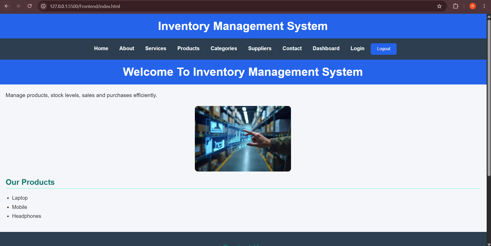
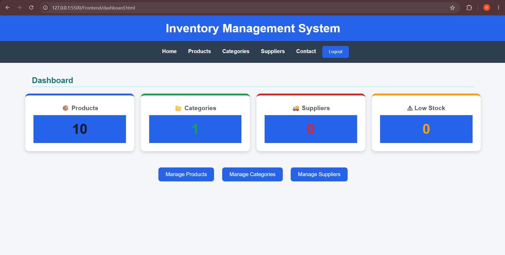
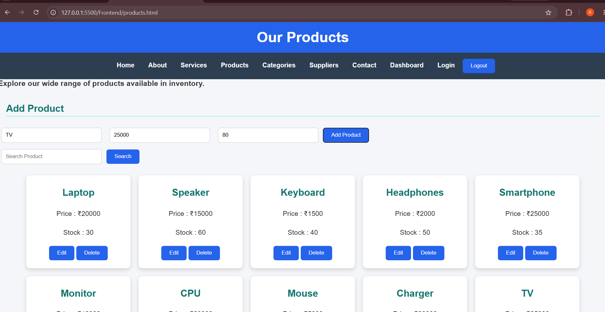
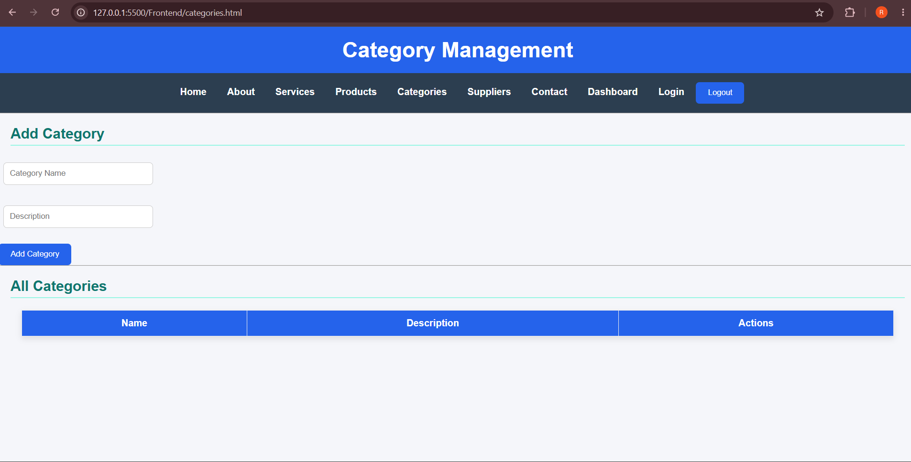
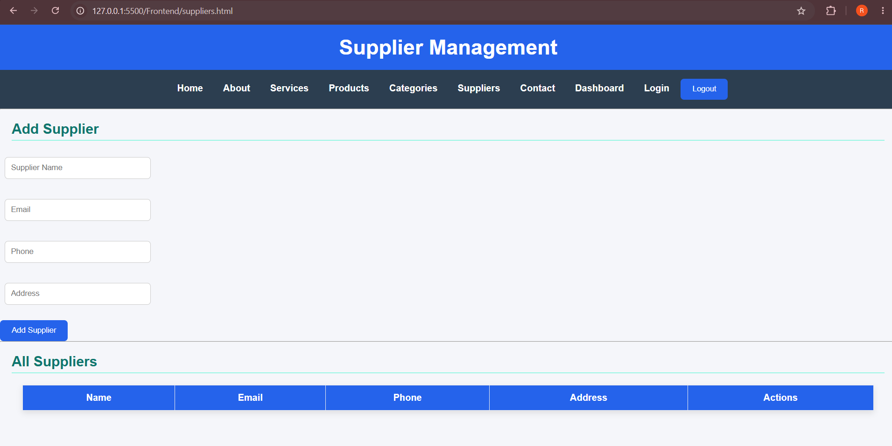
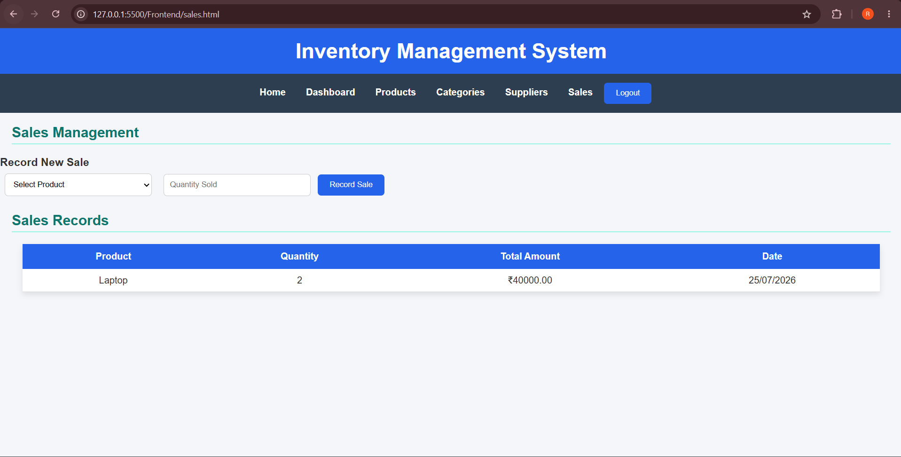
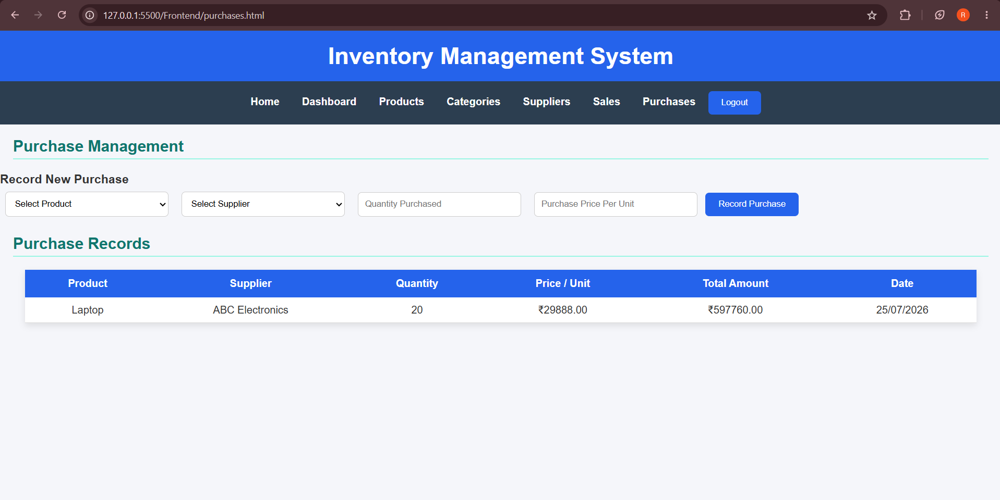
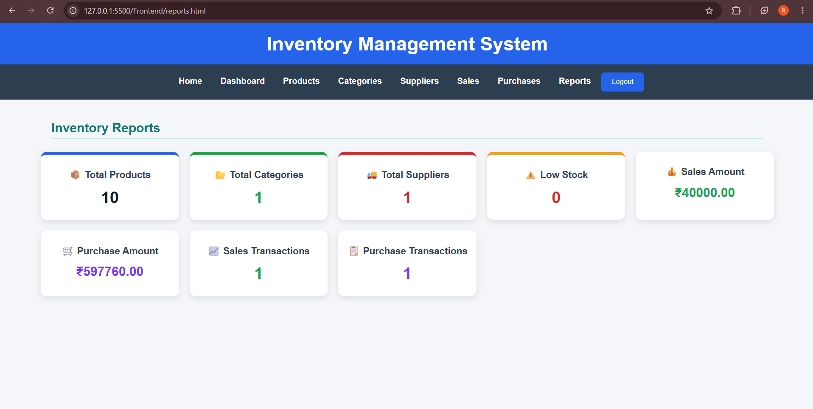

# 📦 Code-A-Nova Inventory Management System

A Full Stack Inventory Management System developed as part of the **Code-A-Nova Full Stack Development Internship**.

The application provides a simple and secure way to manage products, categories, suppliers, stock, sales, purchases, and inventory reports.


## ✨ Features

- User Registration and Login
- JWT-Based Authentication
- Secure Password Hashing using bcrypt
- Product Management (Add, View, Update, Delete)
- Category Management
- Supplier Management
- Inventory Stock Tracking
- Low Stock Monitoring
- Sales Management
- Automatic Stock Reduction after Sales
- Prevention of Sales Exceeding Available Stock
- Purchase Management
- Automatic Stock Increase after Purchases
- Sales History
- Purchase History
- Inventory Reports
- Dashboard with Inventory Statistics
- Responsive and User-Friendly Interface

---

## 🛠️ Tech Stack

### Frontend
- HTML5
- CSS3
- JavaScript

### Backend
- Node.js
- Express.js

### Database
- MongoDB
- Mongoose

### Authentication
- JSON Web Token (JWT)
- bcrypt

---

## 📁 Project Structure

```

Code-A-Nova-Inventory-Management-System-Full-Stack/
│
├── Frontend/
│   ├── css/
│   │   └── style.css
│   │
│   ├── js/
│   │   ├── app.js
│   │   ├── login.js
│   │   ├── register.js
│   │   ├── dashboard.js
│   │   ├── products.js
│   │   ├── categories.js
│   │   ├── suppliers.js
│   │   ├── sales.js
│   │   ├── purchases.js
│   │   └── reports.js
│   │
│   ├── index.html
│   ├── about.html
│   ├── service.html
│   ├── contact.html
│   ├── login.html
│   ├── register.html
│   ├── dashboard.html
│   ├── products.html
│   ├── categories.html
│   ├── suppliers.html
│   ├── sales.html
│   ├── purchases.html
│   └── reports.html
│
├── Inventory Backend/
│   ├── controllers/
│   │   └── authController.js
│   │
│   ├── middleware/
│   │   └── authMiddleware.js
│   │
│   ├── models/
│   │   ├── User.js
│   │   ├── Product.js
│   │   ├── Category.js
│   │   ├── Supplier.js
│   │   ├── Sale.js
│   │   └── Purchase.js
│   │
│   ├── routes/
│   │   ├── authRoutes.js
│   │   ├── categoryRoutes.js
│   │   ├── supplierRoutes.js
│   │   ├── dashboardRoutes.js
│   │   ├── saleRoutes.js
│   │   ├── purchaseRoutes.js
│   │   └── reportRoutes.js
│   │
│   ├── package.json
│   ├── package-lock.json
│   └── server.js
│
├── screenshots/
│
├── .gitignore
└── README.md

```
---

## 🔄 Inventory Workflow

The system automatically manages inventory based on sales and purchases.

### Purchase

When a purchase is recorded:

1. Product and supplier are selected.
2. Purchase quantity and price are entered.
3. Total purchase amount is calculated.
4. Purchase record is stored in MongoDB.
5. Product stock automatically increases.

### Sale

When a sale is recorded:

1. Product and quantity are selected.
2. The system checks available stock.
3. Total sales amount is calculated.
4. Sale record is stored in MongoDB.
5. Product stock automatically decreases.

The system prevents sales when the requested quantity exceeds the available stock.

### Low Stock Monitoring

Products with stock below **10 units** are counted as low-stock products and displayed on the dashboard and reports.

---

## ⚙️ Installation

### 1. Clone the Repository

``bash
git clone https://github.com/ramyanagesh29/Code-A-Nova-Inventory-Management-System-Full-Stack-.git


Open the project folder:

``bash
cd Code-A-Nova-Inventory-Management-System-Full-Stack-
`

 2. Backend Setup

Open the backend folder:

``bash
cd "Inventory Backend"
`

Install dependencies:

``bash
npm install
`

Create a `.env` file inside the `Inventory Backend` folder:

``env
MONGO_URI=your_mongodb_connection_string
JWT_SECRET=your_jwt_secret
`

> The `.env` file is excluded from the repository for security.

Start the backend:

```bash
npm start
```

Or:

```bash
node server.js
```

The backend runs at:

```text
http://localhost:3000
```

### 3. Frontend Setup

Open the `Frontend` folder and run the HTML files using a local development server such as VS Code Live Server.

Start with:

```text
index.html
```

---

## 🔐 Authentication

The application uses:

* User Registration
* User Login
* JWT Authentication
* bcrypt Password Hashing
* Protected Backend Routes

After successful login, a JWT token is used to access protected APIs.

---

## 📊 Dashboard

The dashboard displays:

* Total Products
* Total Categories
* Total Suppliers
* Low Stock Products

It also provides quick access to:

* Products
* Categories
* Suppliers
* Sales
* Purchases
* Reports

---

## 📈 Reports

The Reports page provides:

* Total Products
* Total Categories
* Total Suppliers
* Low Stock Products
* Total Sales Amount
* Total Purchase Amount
* Total Sales Transactions
* Total Purchase Transactions

---

## 📷 Project Screenshots

### Home Page



### Dashboard



### Products



### Categories



### Suppliers



### Sales Management



### Purchase Management



### Inventory Reports




---

## 📌 API Endpoints

### Authentication

* `POST /api/auth/register`
* `POST /api/auth/login`

### Products

* `GET /products`
* `POST /products`
* `PUT /products/:id`
* `DELETE /products/:id`

### Categories

* `GET /api/categories`
* `POST /api/categories`
* `PUT /api/categories/:id`
* `DELETE /api/categories/:id`

### Suppliers

* `GET /api/suppliers`
* `POST /api/suppliers`
* `PUT /api/suppliers/:id`
* `DELETE /api/suppliers/:id`

### Dashboard

* `GET /api/dashboard`

### Sales

* `GET /api/sales`
* `POST /api/sales`

### Purchases

* `GET /api/purchases`
* `POST /api/purchases`

### Reports

* `GET /api/reports`

---

## 🔮 Future Enhancements

Possible future improvements include:

* Product Image Upload
* Role-Based Access Control (Admin/User)
* Export Reports to Excel/PDF
* Email Notifications for Low Stock
* Advanced Search and Filtering
* Sales and Purchase Charts
* Date-Based Report Filtering

---

## 👩‍💻 Author

**Ramya N**

GitHub: ramyanagesh29

LinkedIn: https://www.linkedin.com/in/ramya-n2918/

---

## 📄 License

This project was developed for educational purposes as part of the **Code-A-Nova Full Stack Development Internship**.


